 # Descripción de la API

Este proyecto consiste en una API que maneja tres documentos principales: **Usuario**, **Dirección** y **Tareas**. A continuación, se detallan cada uno de los documentos y sus respectivos campos.

## Documentos

### 1. Usuario
Este documento representa a los usuarios registrados en el sistema.

**Campos:**
- `id` (String): Identificador único del usuario.
- `username` (String): Nombre de usuario.
- `email` (String): Correo electrónico del usuario.
- `password` (String): Contraseña encriptada del usuario.
- `telefono` (String): Número de teléfono del usuario.
- `direccion` (Direccion): Referencia a la dirección del usuario.
- `rol` (String): USER o ADMIN (USER por defecto).

### 2. Dirección
Este documento almacena la información sobre las direcciones asociadas a los usuarios.

**Campos:**
- `id` (String): Identificador único de la dirección.
- `calle` (String): Nombre de la calle.
- `numero` (String): Número de la casa o apartamento.
- `ciudad` (String): Ciudad de residencia.
- `codigo_postal` (String): Código postal de la dirección.

### 3. Tareas
Este documento representa las tareas asignadas a los usuarios.

**Campos:**
- `id` (String): Identificador único de la tarea.
- `usuario_id` (String): Identificador del usuario al que pertenece la tarea.
- `titulo` (String): Título de la tarea.
- `descripcion` (String): Descripción detallada de la tarea.
- `estado` (String): Estado de la tarea (`pendiente`, `completada`).
- `fecha_creacion` (Date): Fecha en la que se creó la tarea.

---

## ENDPOINTS

### 1. **Usuario**:
- `POST /usuarios`: Crear un nuevo usuario (Registro).
- `POST /usuarios/login`: Autenticación de usuario (Login).
- `GET /usuarios/{id}`: Obtener un usuario específico por su ID.
- `PUT /usuarios/{id}`: Actualizar los datos de un usuario **(Solo Admin o el propio usuario)**.
- `DELETE /usuarios/{id}`: Eliminar un usuario por su ID **(Solo Admin o el propio usuario)**.
- `GET /usuarios`: Obtener una lista de todos los usuarios **(Solo Admin)**.

### 2. **Dirección**:
- `POST /direcciones`: Crear una nueva dirección.
- `GET /direcciones/{id}`: Obtener una dirección específica por su ID.
- `PUT /direcciones/{id}`: Actualizar una dirección existente.
- `DELETE /direcciones/{id}`: Eliminar una dirección por su ID.
- `GET /usuarios/{usuario_id}/direcciones`: Obtener todas las direcciones de un usuario.

### 3. **Tareas**:
- `POST /tareas`: Crear una nueva tarea (por cualquier usuario o Admin).
- `GET /tareas/{id}`: Obtener una tarea específica por su ID.
- `PUT /tareas/{id}`: Actualizar una tarea **(Solo Admin)**.
- `DELETE /tareas/{id}`: Eliminar una tarea **(Solo Admin o la propia tarea del usuario)**.
- `GET /usuarios/{usuario_id}/tareas`: Obtener todas las tareas de un usuario **(Solo Admin para otros usuarios)**.
- `GET /tareas`: Obtener todas las tareas **(Solo Admin)**.

---

  ## Lógica de negocio

### 1. **Roles de usuario**
- El rol **USER** solo podrá ver, crear, marcar como completadas y eliminar tareas propias.
- El rol **Admin** tendrá acceso completo para ver, crear, eliminar y actualizar tareas de cualquier usuario, así como ver todos los usuarios.

### 2. **Autenticación**
- Los usuarios deben autenticarse para obtener un token JWT. Este token debe incluir los detalles del rol (User o Admin) y se debe verificar en cada solicitud para garantizar que el usuario tenga acceso al recurso solicitado.

### 3. **Permisos de usuario**
- **Usuario con rol USER** solo puede gestionar tareas y direcciones propias.
- **Usuario con rol Admin** puede gestionar tareas, direcciones y usuarios de cualquier usuario.

### 4. **Flujo de tareas**
- Las tareas pueden pasar de un estado `pendiente` a `completada`, pero un Admin puede modificar cualquier tarea, mientras que un usuario solo puede modificar las suyas.

### 5. **Protección de datos**
- Un usuario solo puede actualizar o eliminar su propia cuenta, tareas y direcciones. Las solicitudes a recursos de otros usuarios serán bloqueadas si no es un Admin.

---

## Excepciones y Códigos de estado

1. **404 Not Found**:
   - Cuando un recurso no se encuentra (usuario, dirección, tarea).

2. **400 Bad Request**:
   - Cuando los datos proporcionados no son válidos o están incompletos (por ejemplo, falta un campo obligatorio).

3. **401 Unauthorized**:
   - Cuando el usuario no está autenticado o el token de acceso es inválido.

4. **403 Forbidden**:
   - Cuando un usuario intenta acceder a recursos que no le pertenecen sin permisos (por ejemplo, un usuario intentando ver o eliminar tareas de otro usuario).

5. **500 Internal Server Error**:
   - Para cualquier error no controlado en el servidor (por ejemplo, problemas en la base de datos).

---

## Restricciones de seguridad

1. **Autenticación y autorización**:
   - Uso de JWT (JSON Web Token) para la autenticación. Solo los usuarios autenticados pueden acceder y modificar sus propios recursos. Los Admins tienen permisos para acceder y modificar los recursos de cualquier usuario.
   
2. **Cifrado de contraseñas**:
   - Las contraseñas se *hashea* antes de almacenarse en la base de datos.

3. **Validación de entradas**:
   - Se valida que los datos entrantes sean correctos.
  
---

## Pruebas gestión de usuarios

### Retrofit
Es un object que contiene la url de nuestra api en render y nos devuelve un ApiService.
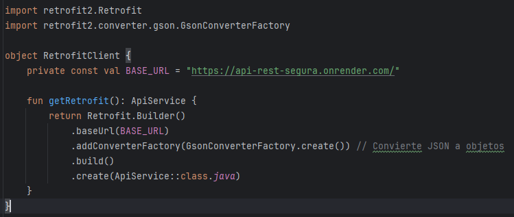

### ApiService
Es una interfaz que se encarga de las peticiones a nuestra api.
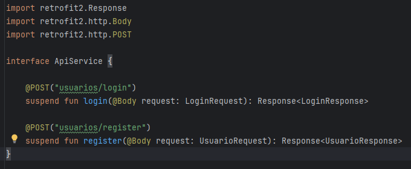

### Clases para login
Son las clases que usamos para mandar la petición del login y para el *Response* del endpoint correspondiente.
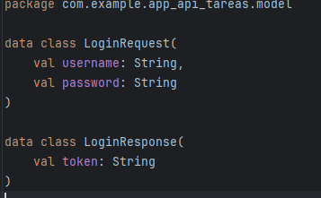

### Clases para registro
Son las clases que usamos para mandar la petición del registro y para el *Response* del endpoint.
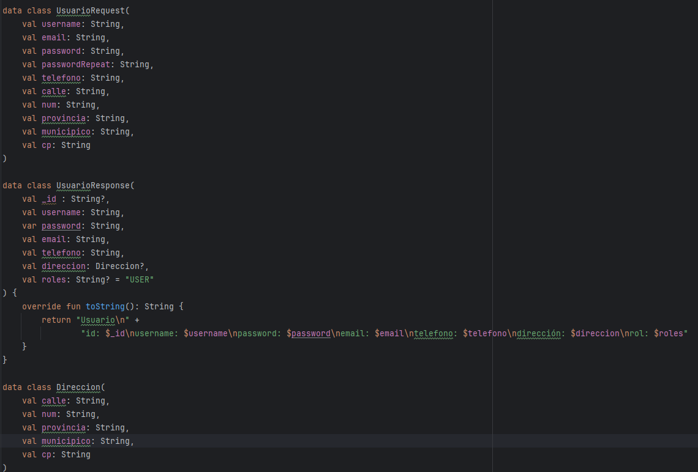

### Pruebas login
Primero comprobamos nuestra base de datos que está vacía.
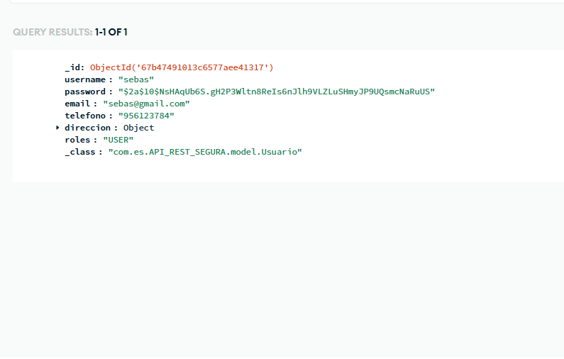

Si intentamos loguearnos, lógicamente dará error ya que no existe ningún usuario registrado.
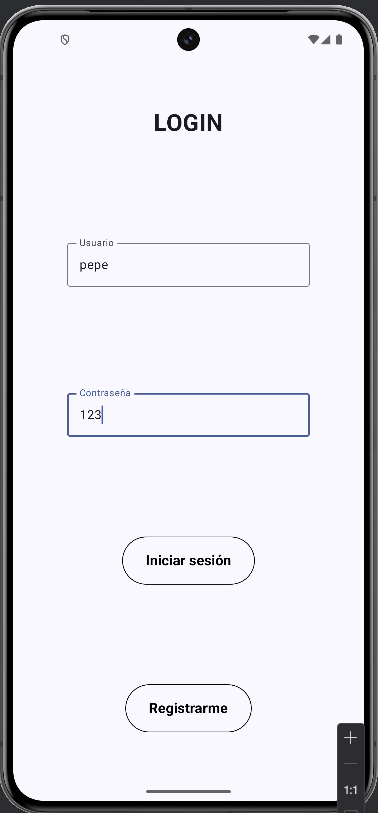
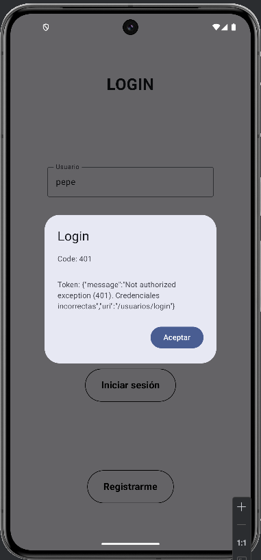

Por lo tanto, vamos a registrar un usuario de forma correcta para hacer las pruebas del login. Después probaremos los errores del registro.
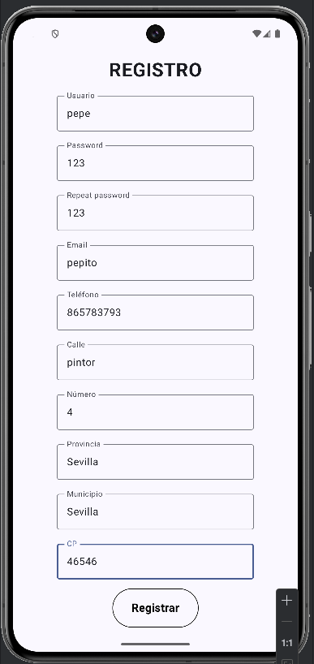
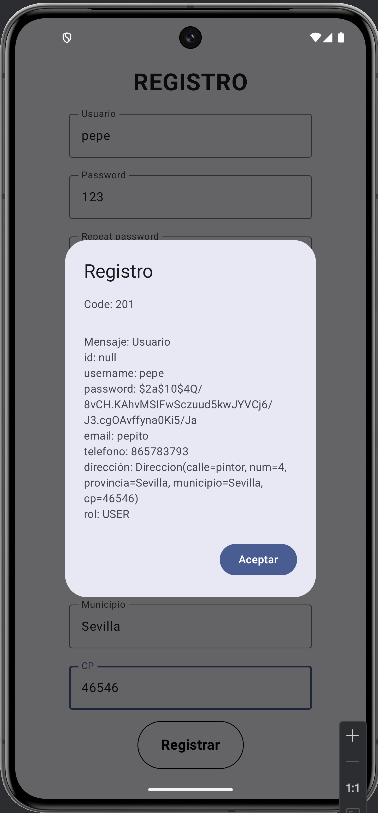

Volvemos a nuestra pantalla de login.
Vamos a intentar acceder introduciendo mal la constraseña: correcta(123) - incorrecta(1234).
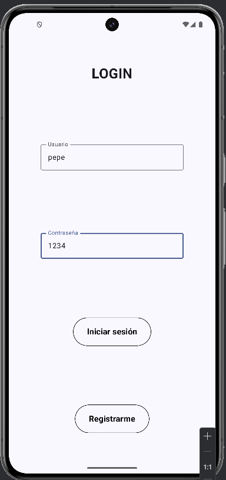

Para comprobar un login correcto, introducimos la contraseña correcta del mismo usuario: Contraseña -> 123.

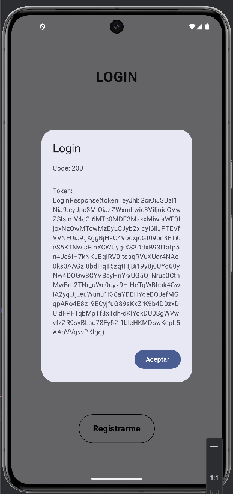

---

### Pruebas registro

Ya hemos introducido un usuario **pepe**.
Vamos a intentar introducir otro con el mismo nombre de usuario.
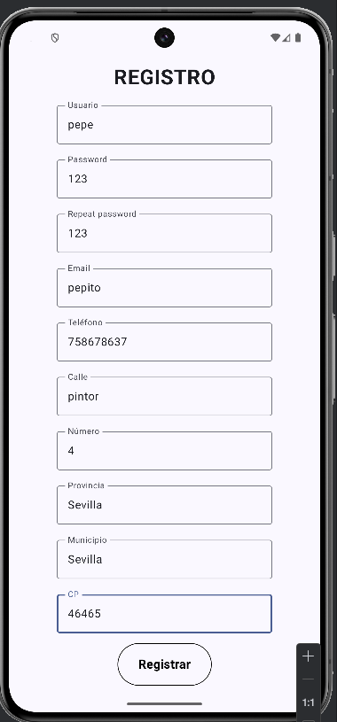
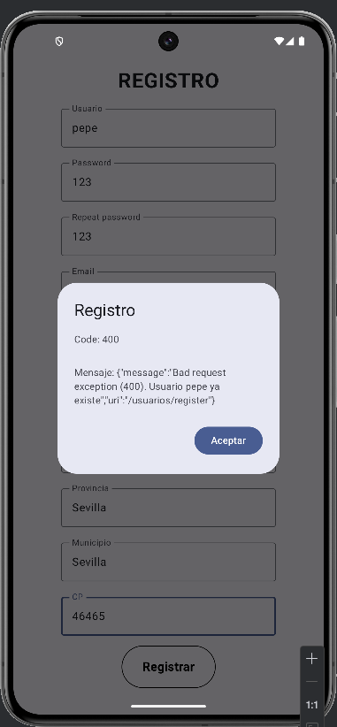

Vamos a introducir un nuevo usuario para probar otros errores, en esta ocasión con la **Provincia**.
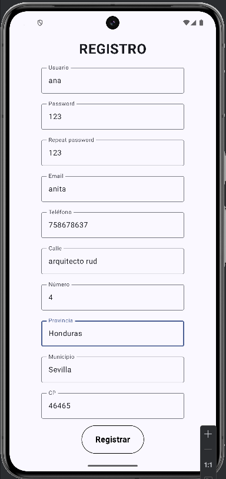
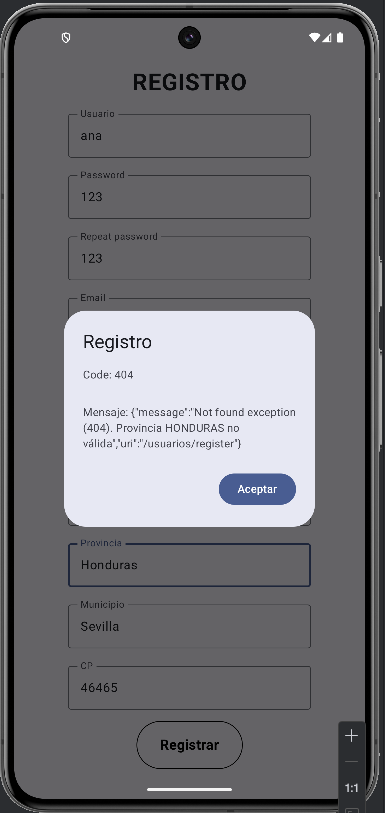

Repetimos la misma acción, pero esta vez vamos a provocar que el error se produzca en el **Municipio**.
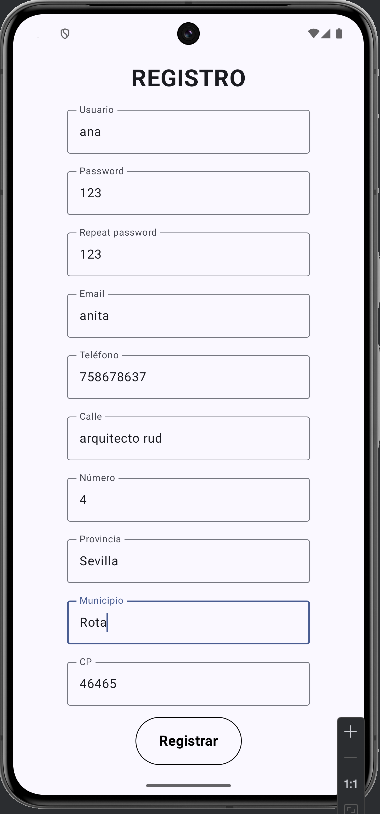
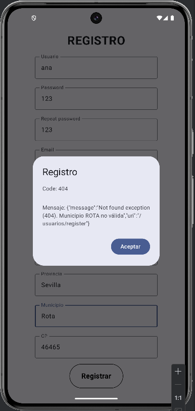

Por último, intentamos registrar al nuevo usuario que tenga guerra nos ha dado, ahora si, con los datos correctos.
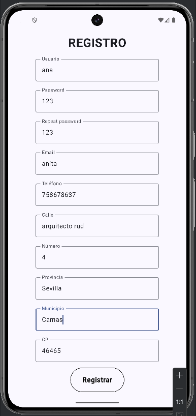
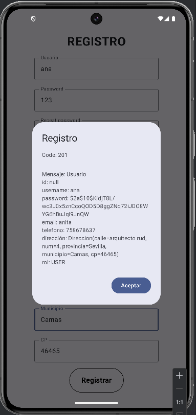

